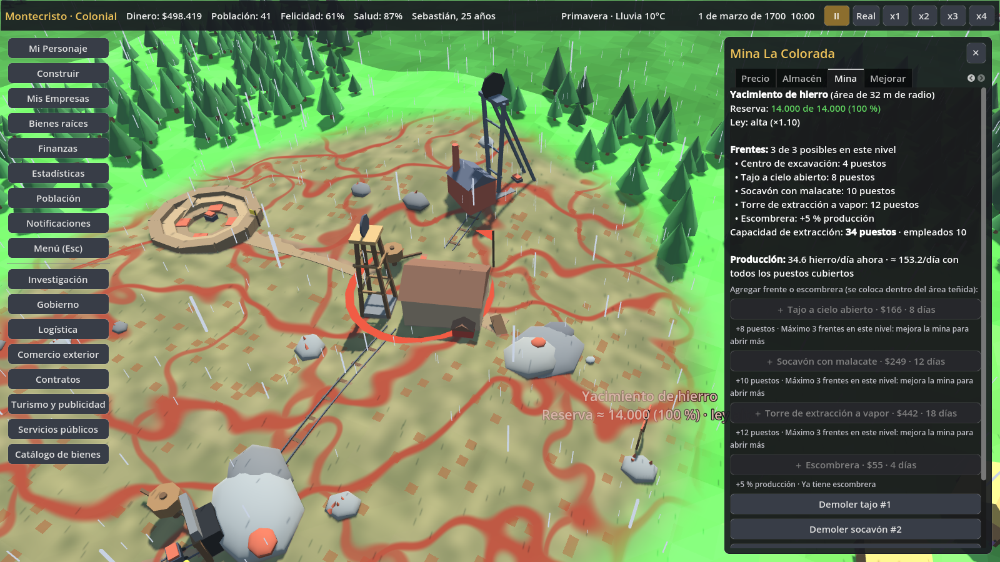

# Minas por partes

Pedido de Sebastián: "las minas eran como un punto normal y ya". Ahora un yacimiento es un
**área** y la mina se arma por partes: un centro de excavación y frentes dentro del área.

## Para el jugador
1. **Yacimientos como áreas.** Cada yacimiento es una zona irregular con el suelo teñido según el mineral:
   vetas rojizas para el hierro, negras para el carbón, doradas para el oro, plateadas para la plata, y manchas
   oscuras para el petróleo y el gas. Tiene rocas y afloramientos encima y un cartel con el nombre, la reserva
   estimada y la ley. El tamaño depende del tipo y de la cantidad:

   | Tipo | Radio (m) | Patrón |
   |---|---|---|
   | Oro | 18–23 | vetas pequeñas |
   | Plata | 19–26 | vetas |
   | Hierro | 26–36 | vetas grandes |
   | Carbón | 28–38 | vetas grandes |
   | Cobre | 24–32 | vetas |
   | Uranio | 18–22 | vetas |
   | Petróleo | 30–40 | campo con manchas |
   | Gas natural | 28–36 | campo con manchas |

   Los yacimientos cercanos al pueblo se recortan para no cubrir la plaza. La **reserva total es finita**.
   Por debajo del 30 % la extracción rinde menos (hasta la mitad), al llegar al 20 % aparece un aviso y, al
   agotarse, la mina **cierra** y despide a su personal.
2. **El centro de excavación** es el edificio principal: una mina o un pozo. Se coloca **dentro** del área. Fuera
   se bloquea con este mensaje: "El centro de excavación va DENTRO del área de un yacimiento de …". Al colocarlo, las
   áreas del mineral que necesita se resaltan con un contorno verde, y la pista muestra la reserva y la ley.
   Sin frentes, el centro solo ocupa el 30 % de los empleos del nivel, así que produce poco.
3. **Los frentes** se agregan desde la pestaña **Mina** del edificio con "＋ …". Se colocan con un fantasma verde
   dentro del área y rojo fuera. R y T giran el frente, el clic lo construye, Shift mantiene el modo activo y Esc
   o el clic derecho cancelan. Cada frente suma puestos (capacidad de extracción y empleos) y tiene costo, tiempo
   de obra y mantenimiento. Se une al centro con un camino, rieles o una tubería.

   | Frente | Conjunto | Capacidad | Costo (× costo de la mina) | Días | Requisito |
   |---|---|---|---|---|---|
   | Tajo a cielo abierto (terrazas) | minas | ×1,0 | 0,30 | 8 | — |
   | Socavón con malacate (bocamina con rieles) | minas | ×1,25 | 0,45 | 12 | mina nivel 2 (pólvora) |
   | Torre de extracción a vapor | minas | ×1,5 | 0,80 | 18 | Máquina de vapor |
   | Torre de perforación | pozos | ×1,0 | 0,30 | 10 | — |
   | Balancín eléctrico | pozos | ×1,3 | 0,45 | 12 | pozo nivel 2 |
   | Escombrera (extra, máx. 1) | minas | +5 % producción | 0,10 | 4 | — |

   Límite de frentes por nivel: 2, 3 y 4.
4. **Producción** ≈ mín(empleados, puestos) × productividad × ley × rendimiento por reserva × (1 + bono de la escombrera).
   Los puestos se calculan así: centro = ⌈30 % de los empleos del nivel⌉; un frente básico aporta el resto de los
   empleos del nivel. Por eso una mina con **1 tajo** tiene exactamente los mismos empleos y la misma producción por
   empleado que antes, y sus márgenes no cambian: el diagnóstico de test_fase6 sigue en 32 % y test_economia_real
   sigue en verde. Cada frente adicional agrega más puestos con el mismo margen por trabajador.
5. **La pestaña Mina** muestra la reserva restante y su porcentaje, la ley, la lista de frentes con sus puestos (y las
   obras en curso), la capacidad frente a los empleados, la producción actual y la estimada con todos los puestos
   cubiertos, los botones para agregar frentes (con el motivo si aún no se puede) y los botones para demoler frentes.

## Diseño técnico
| Archivo | Contenido |
|---|---|
| `data/mining.json` | radios, patrones y leyes por tipo; frentes y extras (capacidad, costo, días, mantenimiento, requisitos y modelos en formato MeshLib); modelos del centro por nivel (`center_models`), huella (`center_footprint`) y parámetros de agotamiento. Lo genera `gen_mining.py` (fuera del repo); se puede editar a mano. |
| `scripts/sim/mine_sim.gd` | `MineSim`: áreas (`ensure_area`, `contains`, `radius_at`), capacidad y empleos, `workforce`, `yield_mult`, frentes (`add_part`, `part_block_reason`, `remove_part`), `daily` (obras, mantenimiento y cierre) y `patch_defs` |
| `scripts/world/mining_visuals.gd` | malla del área sobre el terreno (misma rejilla que Terrain, sin tocar terrain.gd), rocas, cartel, frentes con sus conexiones, modo de colocación y resaltado |
| `shaders/deposit_area.gdshader` | tinte con vetas o manchas, borde irregular (12 radios, igual que `MineSim.radius_at`) y contorno de resaltado |
| `scripts/ui/mine_tab.gd` | pestaña "Mina" |
| `tests/test_minas.gd` | áreas, bloqueo fuera del área, frentes, agotamiento y cierre, migración, guardado y carga, e interfaz |
| `tests/screenshot_mina.gd` | captura `docs/capturas/mina.png` |

### Estado
- `logistics.deposits[i]` suma `radius`, `shape` (12 multiplicadores) y `grade` (ley).
- En la mina, `b["mine"] = {parts: [{id, kind, x, z, rot, status: "obra"|"activo", days_left}], implicit, next_part, deposit_id}`.

Todo se guarda solo, porque vive dentro de `logistics` y de los edificios.

### Migración
- **Yacimientos puntuales** (partidas viejas o pruebas que escriben `deposits` directamente): `RegionSim.deposits()`
  los completa al leerlos con un área centrada en el mismo punto y **ley 1**. La forma es determinista (sale del
  id, el tipo y la posición).
- **Minas sin `b["mine"]`** (partidas viejas, empresas NPC o pruebas que usan `make_building`): reciben
  **1 frente implícito** y producen igual que antes. Solo `ConstructionSim.start_construction`, que es la
  construcción del jugador, crea minas sin frentes.
- **Tolerancia**: si una mina vieja estaba a 11 m o menos del punto (la regla anterior) pero cae fuera del borde
  irregular, conserva su yacimiento.

### Cambios en archivos compartidos (ganchos de una línea)
- `game_data.gd`: `MineSim.patch_defs(self)` al final de `load_all`. Los negocios con `requires_deposit` usan los
  modelos grandes del centro y la huella de 9, 10,5 y 12 m. Los JSON de negocios no se tocan.
- `game_state.gd`: `MineSim.daily(self)` después de `ConstructionSim.daily`.
- `business_sim.gd`: `expected_output` usa `MineSim.workforce` y `MineSim.yield_mult`, y `hire` usa `MineSim.jobs`.
- `construction_sim.gd`: `placement_block_reason` impide construir encima de frentes (`MineSim.parts_block_reason`)
  y `start_construction` llama a `MineSim.on_new_building`.
- `region_sim.gd`: yacimientos por área (`nearest_deposit`, `deposit_block_reason`, `deposit_for` guarda
  `deposit_id`), aviso al 20 %, `init_new_deposit` al generar o revelar, y separación entre yacimientos por
  entrada (los edificios siguen a 18 m).
- `resources.json`: `deposit_min_spacing` pasa de 18 a 40 para que las áreas no se encimen.
- `world.gd`: agrega `MiningVisuals` a la lista de visuales, suma su texto a la pista de colocación y cancela el
  modo frente al empezar a construir.
- `building_panel.gd`: pestaña "Mina" y "Empleados: x/y" con `MineSim.jobs`.

### Límites conocidos
- Las canteras y los leñadores no tienen yacimiento y no cambian.
- La obra de un frente avanza solo con el tiempo (su costo ya incluye la mano de obra); no usa jornaleros.
- El marcador con banderín de `logistics_visuals.gd` sigue en el centro del área.
