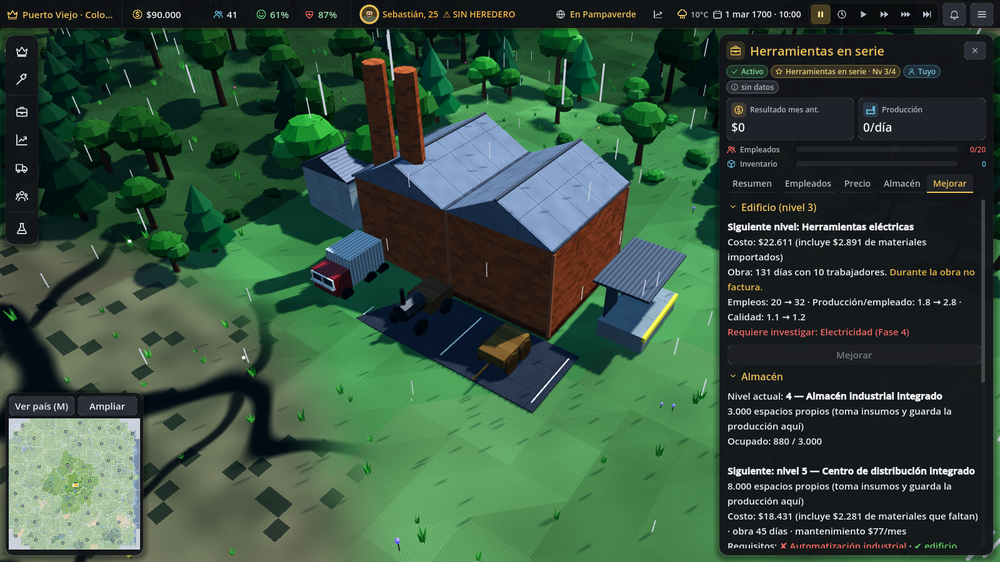
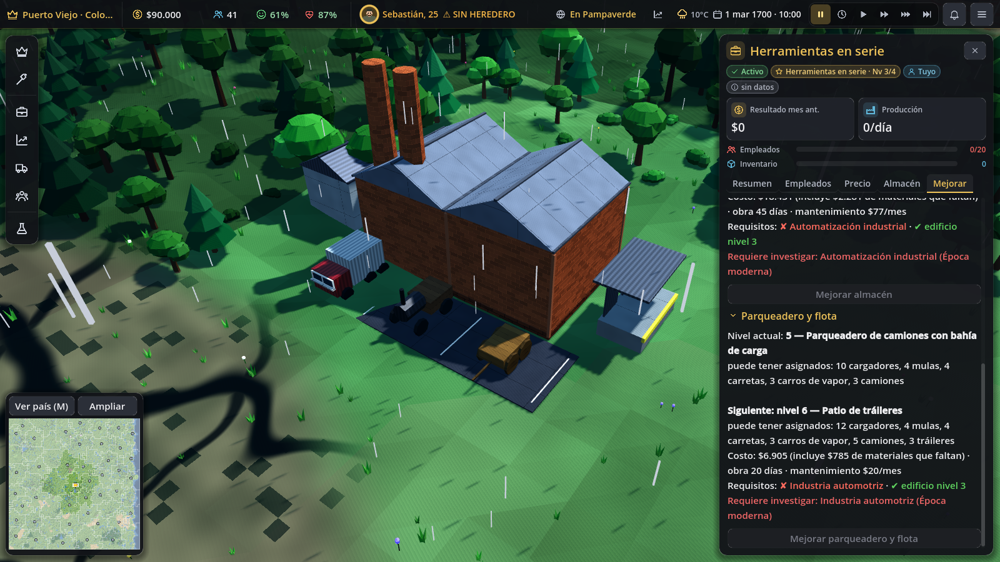
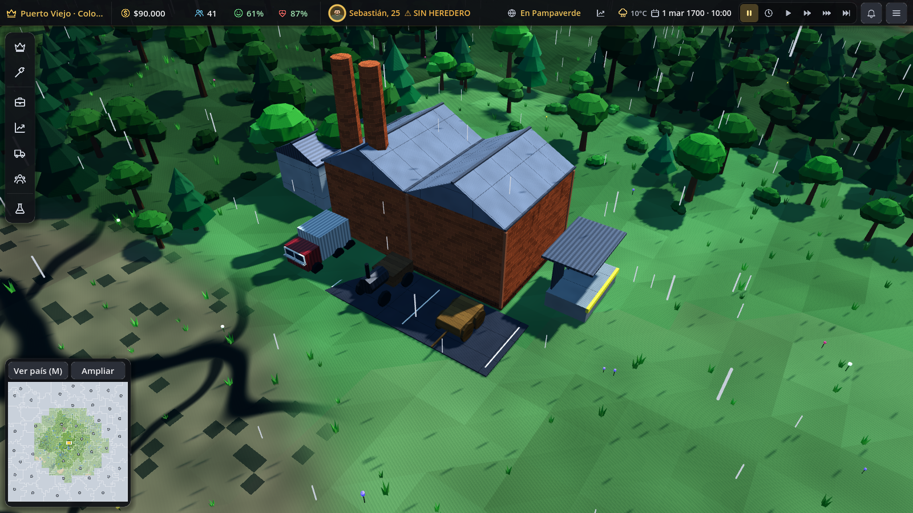

# Módulos por edificio: nivel de fábrica, almacén integrado y parqueadero y flota

Pedido de Sebastián: además del nivel del edificio, submejoras con su propio nivel en la misma pestaña
«Mejorar», que dependen de la investigación. Ajustes posteriores del usuario (incorporados):
el almacén integrado existe desde el nivel 1 en todo negocio productor o comercio; el parqueadero
no es para autos de empleados sino para los vehículos de la empresa (se fusionó con la Flota); y al
colocar un edificio se reserva espacio para que pueda crecer.





## Líneas de mejora (pestaña «Mejorar»)
Cada línea tiene **su propio nivel**, independiente del nivel del edificio. Secciones plegables:
**Edificio** (lo de siempre), **Almacén** y **Parqueadero y flota**. Cada sección muestra el nivel
actual y sus beneficios, el siguiente nivel con beneficios, costo (dinero + materiales que faltan),
días de obra y mantenimiento mensual, los requisitos (tecnología ✔/✘ y nivel del edificio ✔/✘) y el
botón Mejorar. Viviendas, servicios, bancos, estaciones de transporte y almacenes no tienen módulos.

Aplica a los **negocios productores y comercios** (`ModulesSim.is_cargo_type`): fábricas, talleres,
minas (el centro de excavación), campos, granjas y cualquier negocio cuyo producto sea un bien
almacenable, más comercios y la tienda.

### Almacén integrado (`almacen`)
| Nivel | Nombre | Espacios | Tecnología | Edificio mín. | Costo | Días | Mant./mes |
|---|---|---|---|---|---|---|---|
| 1 | Depósito del negocio (incluido) | 100 | — | 1 | — | — | — |
| 2 | Bodega anexa | 300 | Bodegas anexas (colonial) | 1 | $650 + madera 30, piedra 10 | 8 | $6 |
| 3 | Nave de almacenaje | 1.000 | Almacenes industriales (industrial) | 2 | $2.400 + madera 20, piedra 50 | 16 | $14 |
| 4 | Almacén industrial integrado | 3.000 | Logística integrada (moderna) | 3 | $7.800 + madera 30, piedra 140 | 28 | $36 |
| 5 | Centro de distribución integrado | 8.000 | Automatización industrial | 3 | $19.000 + madera 40, piedra 320 | 45 | $90 |

- Es **un almacén más de `WarehouseSim`** con el id del edificio: aparece en `ids()`, en la API
  agregada (ventas, contratos, construcción, tiendas) y como origen/destino de rutas.
- **Orden de uso** (`WarehouseSim.chain_ids`): el negocio toma insumos y guarda producción primero en
  su almacén integrado y luego en el almacén separado vinculado al lado (≤ 12 m). Si ambos se llenan,
  la producción se detiene con aviso. Ya no existe «sin almacén: la producción queda en el sitio».
- Es **privado**: los vecinos no se vinculan al almacén integrado de otro negocio
  (`ModulesSim.is_private_warehouse`); siguen usando los almacenes separados.
- Los **almacenes separados** se siguen construyendo como almacenamiento general al que se lleva
  mercancía con rutas. Ya no se dibujan anillos verde/rojo ni flechas de vínculo, ni etiqueta 3D sobre
  los almacenes integrados (su ocupación está en el panel del negocio).
- Más caro por espacio que el almacén separado (nivel 2: $2,2/espacio vs. $0,8 de la Bodega de madera),
  pero no ocupa terreno aparte. El anexo agranda un poco la huella.
- Una ruta que sale de un negocio con almacén integrado despacha de su almacén y luego de lo que haya
  quedado en su patio (inventario local de partidas viejas).

### Parqueadero y flota (`parqueadero`)
Es donde la empresa guarda **sus vehículos de carga**. Define cuántos y de qué tipo puede tener
asignados. Los vehículos se compran en el panel central «Vehículos» (agente de rutas) y se asignan a la
compañía; la conexión que exige cada tipo (carretera, rieles, agua o pista) la valida quien asigna.

| Nivel | Nombre | Cupos por tipo | Tecnología | Edificio mín. | Costo | Días | Mant./mes |
|---|---|---|---|---|---|---|---|
| 1 | Cargadores a pie | pie 4 (solo vacantes) | — | 1 | $180 + madera 5 | 3 | $1,5 |
| 2 | Corral de mulas | pie 6, mula 3 | — | 1 | $420 + madera 15 | 5 | $3 |
| 3 | Patio de carretas | pie 8, mula 4, carreta 3 | Carretas de tiro | 2 | $900 + madera 30 | 8 | $5 |
| 4 | Cochera de vapor | … + carro de vapor 2 | Máquina de vapor | 2 | $2.200 + madera 20, piedra 40 | 12 | $9 |
| 5 | Parqueadero de camiones con bahía de carga | … + camión 3 | Bahías de carga (nueva, moderna) | 3 | $3.600 + piedra 60 | 14 | $14 |
| 6 | Patio de tráileres | … camión 5, tráiler 3 | Industria automotriz | 3 | $7.200 + piedra 120 | 20 | $24 |

API para el agente de rutas:
- `ModulesSim.fleet_limit(gs, b, tipo) -> int`: cupos de ese tipo (`pie`, `mula`, `carreta`,
  `carro_vapor`, `camion`, `trailer`…); 0 = no lo admite.
- `ModulesSim.fleet_types(gs, b) -> Array`: tipos admitidos, en el orden de los medios.

El parqueadero **no** cuenta para el trayecto de los empleados: la penalización moderna ×0,95 de
`TransitSim` sigue igual, con los parqueaderos públicos y los paraderos.

### Reglas comunes
- **Requisitos**: tecnología (existente o nueva en `data/technologies_modulos.json`: Bodegas anexas,
  Almacenes industriales, Logística integrada, Bahías de carga; el árbol las ubica solo por época y
  rama sin superponerlas) y **nivel mínimo del edificio**, acotado al nivel máximo del tipo (un negocio
  de 2 niveles puede llegar a todo lo que pide «nivel 3» con su nivel 2).
- **Obra**: costo (× `price_mult`) + materiales (de tu stock; lo que falta se compra), días según el
  nivel del módulo (× velocidad de construcción). Una obra de módulo a la vez por edificio.
- **Decisión: durante la obra de un módulo el negocio SÍ sigue produciendo y facturando** (a diferencia
  de la mejora de nivel): se construye un anexo al lado, no se rehace la planta. La capacidad nueva entra
  al terminar.
- **Mantenimiento mensual** (× `price_mult`), al cerrar el mes, en el rubro «mantenimiento» del negocio.
- **Economía cerrada**: obra y mantenimiento se pagan a vecinos sin empleo (contratistas y proveedores,
  hasta 4 por pago); sin ellos, al tesoro municipal. El total de dinero no cambia.
- **Niveles independientes**: mejorar el edificio no cambia los módulos y viceversa.

## Espacio para crecer
- Cada nivel de edificio y de módulo agranda un poco la huella (`GameState.footprint_of` suma
  `ModulesSim.footprint_extra`).
- **Al colocar** un negocio o una vivienda desde el mundo 3D, se reserva su **huella de crecimiento**
  (`ModulesSim.reserve_footprint`: la del nivel máximo + los módulos al máximo) frente a la reserva de
  los vecinos: «Muy cerca de X: deja espacio para que ambos crezcan». El fantasma muestra un contorno
  tenue del tamaño máximo. Mover un edificio y la API `start_construction` (NPC, pruebas, bienes raíces)
  mantienen la regla anterior; las mejoras siguen bloqueándose con «No hay espacio para ampliar» si
  los edificios existentes están muy juntos.

## Visual 3D (`MeshLib.module_parts`)
Piezas JSON unidas a la malla del edificio (una sola llamada de dibujo), según el nivel:
- **Almacén** 2-5: anexo en +X (madera → ladrillo → concreto → metal), techo, portón, cajas y ventanales.
- **Parqueadero y flota** 1-2: carretillas y fardos (y abrevadero/corral); 3+: patio (tierra, empedrado o
  concreto con líneas) con carretas, carro de vapor, camiones y tráiler; 5+: andén de carga elevado en −X
  con portones, borde amarillo y alero.

## Estado y migración
En el diccionario del edificio: `modules = {"almacen": n, "parqueadero": n}` y `module_work =
{module, target, done, needed, start}`. Sin `modules`, el almacén está en su nivel base (1) y el
parqueadero en 0. **Partidas viejas**: los negocios productores y comercios reciben el almacén integrado
base (100 espacios); lo demás sigue igual.

## Archivos
| Archivo | Contenido |
|---|---|
| `data/modulos.json` | Niveles, costos, días, mantenimiento, requisitos y crecimiento de la huella |
| `data/technologies_modulos.json` | Bodegas anexas, Almacenes industriales, Logística integrada, Bahías de carga |
| `scripts/sim/modules_sim.gd` | `ModulesSim`: niveles, requisitos, costos, obras, mantenimiento, capacidad, `fleet_limit`/`fleet_types`, reserva |
| `scripts/ui/modules_tab.gd` | Secciones Almacén y Parqueadero y flota de la pestaña Mejorar |
| `tests/test_modulos.gd` | 60+ comprobaciones |
| `tests/screenshot_modulos.gd` | Capturas en `docs/capturas/modulos/` |

Ganchos pequeños en archivos compartidos:
- `warehouse_sim.gd`: `is_warehouse_building`/`capacity_of` incluyen el integrado; `nearest_for` salta los
  integrados ajenos; nuevo `chain_ids`.
- `logistics_sim.gd`: `input_available`, `take_input`, `produce_chain`, `in_reach`, `output_target` usan
  `chain_ids`; `endpoint_stock`/`endpoint_take` incluyen el patio de un negocio con almacén integrado.
- `energy_sim.gd`: la producción perdida sin electricidad sale de `chain_ids`.
- `game_state.gd`: `footprint_of` + extra de módulos; `ModulesSim.daily` y `ModulesSim.monthly`.
- `construction_sim.gd`: `placement_block_reason(..., reserve)` y `upgrade_space_reason` con la huella de módulos.
- `world.gd`: piezas de módulos en el modelo y contorno de reserva en el fantasma; `mesh_lib.gd`:
  `module_parts`, `reserve_outline`, `model_half_extent`.
- `logistics_visuals.gd`: sin anillos/flechas/etiquetas para almacenes integrados; texto del fantasma.
- `building_panel.gd` (pestaña Mejorar) y `warehouse_tab.gd` (almacén integrado + vinculado).
- Pruebas ajustadas al nuevo diseño: `test_almacenes.gd` y `test_fase6.gd` (ya no hay «producción en el
  sitio» ni indicador rojo: todo negocio guarda en su almacén integrado).

## Pruebas
```
godot --headless res://tests/test_modulos.tscn
xvfb-run -a -s "-screen 0 1600x900x24" godot --rendering-driver opengl3 --resolution 1600x900 res://tests/screenshot_modulos.tscn -- docs/capturas/modulos
```
