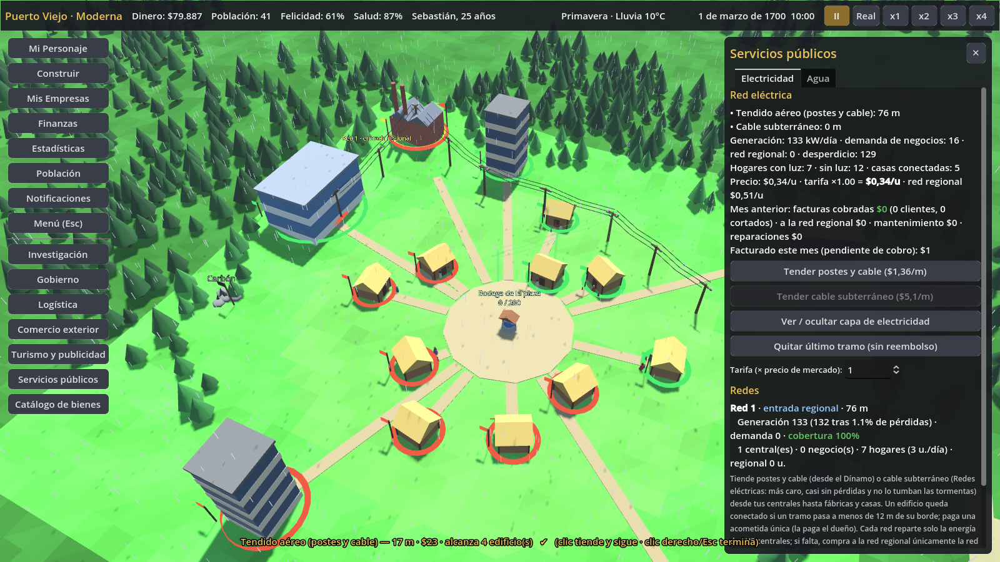

# Redes de servicios públicos — electricidad y agua

Pedido de Sebastián: las industrias avanzadas necesitan electricidad sí o sí, así que hay que tender
cables, primero aéreos y después subterráneos con más investigación. Con el agua pasa lo mismo: al
principio hay pozos, luego se puede vender agua de un río y más adelante se hacen tuberías para que
los vecinos le paguen la factura a tu planta. Las casas altas también necesitan luz y agua.



## Para el jugador
- **Servicios públicos** (botón del menú lateral) tiene dos pestañas:
  - **Electricidad**: tender postes y cable, tender cable subterráneo, ver/ocultar la capa, quitar el
    último tramo, tarifa y una tabla por red (generación contra demanda, pérdidas, cobertura,
    centrales, negocios, hogares, entrada regional, facturas del mes anterior, mantenimiento y
    reparaciones).
  - **Agua**: pozos (cuántos hay, para cuánta gente alcanzan y qué tanto se usan), construir un pozo
    comunitario, una toma de río o una planta de agua, tender tubería, ver la capa, tarifa y la tabla
    de redes de tubería (plantas, producción y casas conectadas).
- **Trazado por tramos**, igual que las carreteras: clic en el inicio, clic en el final, y se sigue
  desde el último punto. Con clic derecho o Esc se termina. El ghost muestra el largo, el costo y
  cuántos edificios alcanza. Los tramos se pegan a los extremos cercanos y se unen si se tocan o se
  cruzan. Cada tramo mide como máximo 60 m.
- **Vista de capa**: la capa eléctrica o la de agua pone un anillo con banderín en cada edificio que
  usa el servicio. Verde significa conectado y abastecido. Rojo significa que lo necesita y no lo
  tiene. Amarillo o azul marca las centrales y plantas. Además, cada red lleva su etiqueta «Red N» y
  se indica cuál toca la «entrada regional». El cable subterráneo y la tubería solo se ven con la capa
  activa o mientras se trazan. Los postes y cables aéreos siempre se ven.
- **Panel de edificio**: muestra «Electricidad: conectado (red N, cobertura X %)», «sin conexión»
  (dice a qué distancia tender el cable y avisa si ese nivel no produce sin electricidad) o «red
  cerca, falta la acometida». También muestra «Agua: tubería / pozo comunitario (abasto X %)» y avisa
  si ese nivel exige tubería.

## Electricidad (`scripts/sim/grid_sim.gd`, `GridSim`)
| Tipo | Tecnología | Costo | Mantenimiento | Pérdidas | Tormentas |
|---|---|---|---|---|---|
| Tendido aéreo (postes y cable) | Dínamo y centrales eléctricas | $1,6/m | $0,015/m/mes | 1,5 % cada 100 m | 4 % de caída por cada 100 m y día de tormenta |
| Cable subterráneo | Redes eléctricas (moderna) | $6/m | $0,008/m/mes | 0,4 % cada 100 m | no se cae |

Todos los costos se multiplican por la dificultad y la inflación (`price_mult`). Las pérdidas de una
red se suman según el largo de sus tramos, con un máximo de 25 %.

- **Conexión**: un edificio está conectado a una red si un tramo sano pasa a 12 m o menos de su
  borde (`reach`). Además, las casas y los negocios que consumen deben pagar una **acometida única**:
  $20 para una vivienda y $30 para un negocio, multiplicados por `price_mult`. La acometida la paga
  el dueño: tú (se descuenta sola si tienes el triple del costo), el vecino propietario o, en las
  chozas del pueblo, el residente con más ahorros. Ese dinero se va en medidor y cable comprados
  fuera del pueblo. El tendido lo paga quien lo construye. Las centrales se conectan sin acometida.
- **Redes**: son las componentes conexas de los tramos sanos. Cada una se identifica con el id de su
  tramo más bajo. **Cada red reparte solo la generación de SUS centrales**, descontadas las
  pérdidas, entre SUS consumidores, igual que antes: la central factura y tu fábrica paga, así que
  para ti el neto es cero. Una central sin cables pierde su electricidad.
- **Red regional**: si en una red falta energía, se compra afuera al precio de importación solo si
  **esa red toca la entrada regional** y existe `EnergySim.grid_available`, es decir, una ruta
  comercial terminada y la tecnología *Electricidad*, como antes. Una red toca la entrada regional
  cuando un tramo pasa a 22,5 m o menos del centro de la plaza, o a 14 m o menos del camino de la
  ruta comercial que sale hacia el oeste. Es el mismo trazado de `TradeVisuals`.
- **Industria que exige electricidad**: los niveles con `"requires_power": true` **no producen nada**
  si no tienen cobertura. Son 40 niveles, entre ellos los automatizados, los electrónicos, los de
  refrigeración, los «eléctricos» y todos los de la fábrica de electrónica y la de
  electrodomésticos. El resto sigue rindiendo `unpowered_output` (50 %) en la parte que no está
  cubierta. `EnergySim.factor` y el descuento de producción usan `EnergySim.unpowered_output(ld)`.
- **Hogares** (desde *Electricidad*): cada adulto con casa conectada consume 0,45 u./día, primero del
  sobrante de las centrales de su red y luego de la red regional si esa red la toca. **No paga
  cada día**: todo se anota en la **factura del mes**, con la tarifa (entre 0,5 y 2,5 × el precio de
  mercado; por defecto 1) para lo que viene de tus centrales y el precio regional para lo de afuera.
  Si la tarifa sube por encima de 1, la luz alegra menos. Al cerrar el mes cada cliente paga, y lo
  propio se reparte entre las centrales según lo que aportó cada una (`BusinessSim.earn` en
  «ventas»). Lo regional sale del pueblo. Quien no alcanza a pagar paga lo que tiene y **queda
  cortado el mes siguiente**. Los hogares sin conexión o cortados pierden felicidad igual que antes.
- **Casas de nivel alto**: desde el nivel 4 (apartamentos, edificio residencial y rascacielos) y
  después de investigar *Electricidad*, la casa exige estar conectada a una red con central o con
  entrada regional. Si no lo está:
  - la calidad baja 0,6 y eso reduce la felicidad y la demanda para vivir ahí;
  - los residentes pierden 0,3 de felicidad por día;
  - la renta y el precio de venta se multiplican por 0,7;
  - cada mes hay 30 % de probabilidad de que se vayan los inquilinos de tus casas;
  - **no se puede mejorar** una casa a esos niveles sin un cable cerca (`ConstructionSim.start_upgrade` →
    `GridSim.upgrade_block_reason`).
- **Tormentas**: cada día de `tormenta`, cada tramo aéreo puede caerse (RNG propio por semilla y día,
  que no altera el resto de la simulación). La red queda partida hasta que se repara sola a los 2
  días, y la reparación cuesta 15 % del valor del tramo.
- **Mantenimiento** mensual: la suma de metros × `upkeep_per_m` × `price_mult`. 1 km de tendido aéreo
  cuesta unos $15 al mes.

### Contrato con EnergySim (cambio respecto a docs/ECONOMIA.md)
- `EnergySim.supply_ratio(gs, b)` **mantiene su firma** y sigue siendo el único punto que consultan
  los consumidores.
- Ahora `EnergySim.daily` delega el reparto en `GridSim.power_daily(gs, st)`, que llena
  `st["coverage"]` solo con lo conectado (0 sin cable) y conserva las claves de `month` y `today`
  que usa `EnergySim.summary`.
- `EnergySim._homes` ya no existe: los hogares se atienden en `GridSim._homes_power` con factura
  mensual.
- `EnergySim.requires_power(ld)` y `EnergySim.unpowered_output(ld)` son nuevos.

## Agua (`scripts/sim/water_sim.gd`, `WaterSim`)
1. **Pozos comunitarios** (por defecto y gratis): quien no le compra agua a nadie la saca del pozo.
   **Ya no se importa agua**; antes los empleados la importaban. La calidad es `self_supply` × `well_mult`.
   La plaza tiene 1 pozo para 80 personas y cada «Pozo comunitario» que construyas ($150, 12 de
   piedra, sin empleados) suma otras 80. El abasto de hoy es la capacidad dividida entre el uso de
   ayer. Si el abasto baja de 100 %, la calidad baja hasta 0,55 y las enfermedades suben hasta ×1,5.
2. **Venta de agua**: el Aguatero se puede construir en cualquier sitio. La **Toma de río** tiene 3
   niveles: toma y aguateros, carretas aguateras y estación de bombeo. Solo se construye a 25 m o
   menos de agua dulce, es decir, de un río o lago bajo el nivel del agua del mapa. Aplica en los
   mapas de río, interior y montaña; en la costa el agua es de mar. Ambos venden el bien `agua` en
   el mercado, que se reparte a pie o en carreta como siempre.
3. **Planta de agua y tubería** (desde *Potabilización del agua*): la Planta de agua tiene
   `water_plant: true` y 3 niveles: potabilizadora, bombas de vapor y tratamiento eléctrico, este
   último con consumo eléctrico. Produce `agua` y la envía por **tuberías subterráneas por tramos**
   ($3,5/m). Las casas conectadas pagan una acometida de $15 y, a partir de ahí:
   - su agua sale de la planta de su red;
   - pagan una **factura mensual** a esa planta, con una tarifa entre 0,5 y 3 × el precio de mercado
     (1,2 por defecto);
   - se enferman menos (×0,8) y la vivienda gana +0,2 de calidad.

   El sobrante de la planta se vende en el mercado como el de cualquier aguatero. Desde
   *Potabilización*, las casas de nivel 4 o más **exigen tubería**, con las mismas penalizaciones que
   la electricidad. Quien no paga queda cortado el mes siguiente y vuelve al pozo o al mercado.

## Economía cerrada
- Las facturas pasan dinero de los vecinos a tus centrales o plantas. La prueba verifica que la suma
  de tu dinero, el de los vecinos y las reservas no cambia al cobrar.
- La parte regional, las acometidas, el tendido, el mantenimiento y las reparaciones salen del pueblo,
  como las importaciones.
- **Balance**: tus propias fábricas se pagan la luz a sí mismas, así que el neto es cero. Tu casa no
  paga factura. Los cables cuestan poco al mes, alrededor de $2 por 180 m.

## Guardado y partidas viejas
- El estado está en `gs.utilities` (`GameState.to_dict/load_dict`). Guarda:
  - los tramos, con su id, tipo, extremos y si están caídos;
  - `next_id`, `version` y las acometidas (`hooked`);
  - las tarifas, facturas, `plant_units` y cortes;
  - el período de gracia;
  - los resúmenes por red, el mes y el pozo.
- Todo tiene valores por defecto.
- **Migración**: si una partida sin `utilities` ya tenía centrales (con el dínamo) o casas de nivel
  4 o más, recibe **120 días de gracia**, con un aviso al primer día. Durante la gracia, todos los
  edificios están en una red virtual global (`GridSim.LEGACY`) que toca la entrada regional, así que
  todo funciona como antes y no se aplican las exigencias de las casas. Al terminar, solo cuenta lo
  conectado. El panel muestra la fecha límite.
- `tests/test_tiendas_energia.gd` suponía el reparto global. Se le hicieron cambios mínimos:
  - se agregó `_cable()`, que tiende un tramo aéreo gratis y cobra las acometidas, en las tres
    pruebas que usan la electricidad;
  - en la de hogares con central propia se cobra la factura (`GridSim._bill`) antes de verificar que
    la central vendió.

## Archivos
| Archivo | Contenido |
|---|---|
| `data/utilities.json` | Configuración de la red (`grid`), del agua (`water`), tipos de tramo (`kinds`) y modelos low-poly de poste, registro y válvula. |
| `data/businesses_redes.json` | Toma de río y Planta de agua, con modelos de torre de agua, tanques y bombas. |
| `data/buildings_redes.json` | Pozo comunitario. |
| `data/businesses_economia.json`, `data/businesses_industria.json` | Se agregó `"requires_power": true` a 40 niveles; es una línea por nivel. |
| `scripts/sim/grid_sim.gd` | Tramos, redes, conexión, acometidas, reparto eléctrico por red, facturas, casas altas, tormentas, mantenimiento, migración y resumen. |
| `scripts/sim/water_sim.gd` | Pozos, agua por tubería, alturas del mapa para encontrar ríos y lagos, y ubicación de la toma de río. |
| `scripts/world/utilities_visuals.gd` | Postes y cables, tramos enterrados, vista de capa y modo de trazado. |
| `scripts/ui/utilities_panel.gd` | Panel «Servicios públicos». |
| `tests/test_redes.gd` | 75 comprobaciones: conectividad, dos redes, industria sin cable, subterráneo y tormentas, casa alta, facturas con dinero conservado, pozos, río, tubería, guardado y migración. |
| `tests/screenshot_redes.gd` | Genera `docs/capturas/redes.png`. |

Cambios mínimos en archivos compartidos:
- `game_state.gd`:
  - variable `utilities` en `to_dict/load_dict/_clear` y `GridSim.init_state` en `_init_expansions`;
  - `GridSim.migrate` para las partidas sin redes;
  - en `simulate_day`: `GridSim.daily` antes de `MarketSim.begin_day`, `WaterSim.daily` después, y
    `GridSim.monthly` antes de `MarketSim.monthly_housing`.
- `energy_sim.gd`: ver el contrato de arriba.
- `market_sim.gd`:
  - `purchase` primero prueba el agua por tubería y, para `agua`, usa el pozo gratis con escasez en
    vez de importar;
  - `home_quality` suma `GridSim.home_quality_delta`;
  - `daily_rent` y el precio de venta en `_try_buy_home` se multiplican por `GridSim.home_value_mult`.
- `population_sim.gd`: la probabilidad de enfermar se multiplica por `WaterSim.disease_mult`.
- `construction_sim.gd`: `placement_block_reason` añade el control de la toma de río y
  `start_upgrade` añade `GridSim.upgrade_block_reason`.
- `hud.gd`: botón «Servicios públicos» y panel en el dock.
- `world.gd`: agrega `UtilitiesVisuals` y cancela el trazado al colocar un edificio.
- `building_panel.gd`: línea `GridSim.panel_lines`.
- `tests/ui_smoke.gd`: abre el panel, traza un cable y alterna las capas.

## Pruebas
```
godot --headless res://tests/test_redes.tscn
xvfb-run -a -s "-screen 0 1600x900x24" godot --rendering-driver opengl3 --resolution 1600x900 res://tests/screenshot_redes.tscn -- docs/capturas
```
