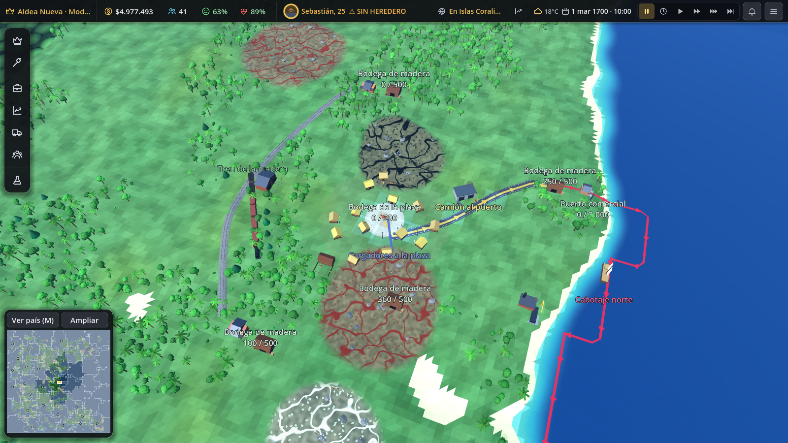
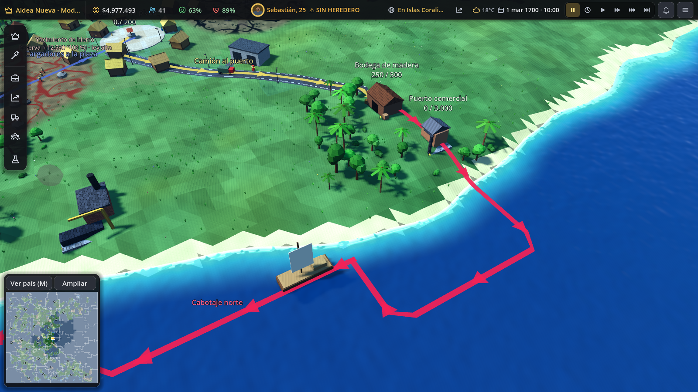
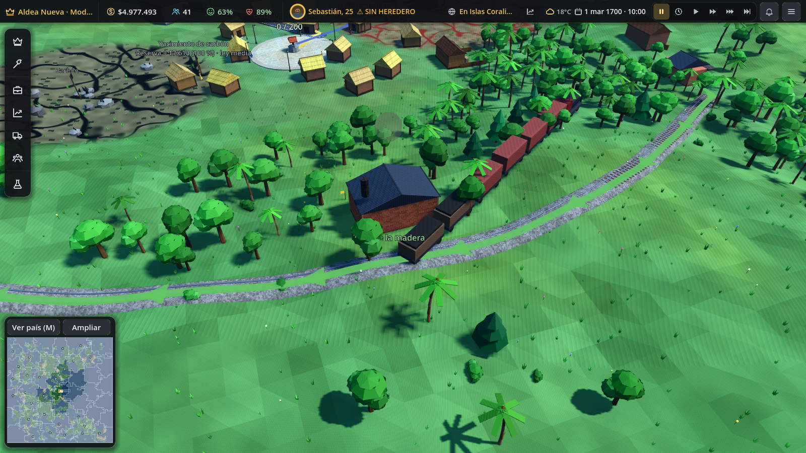
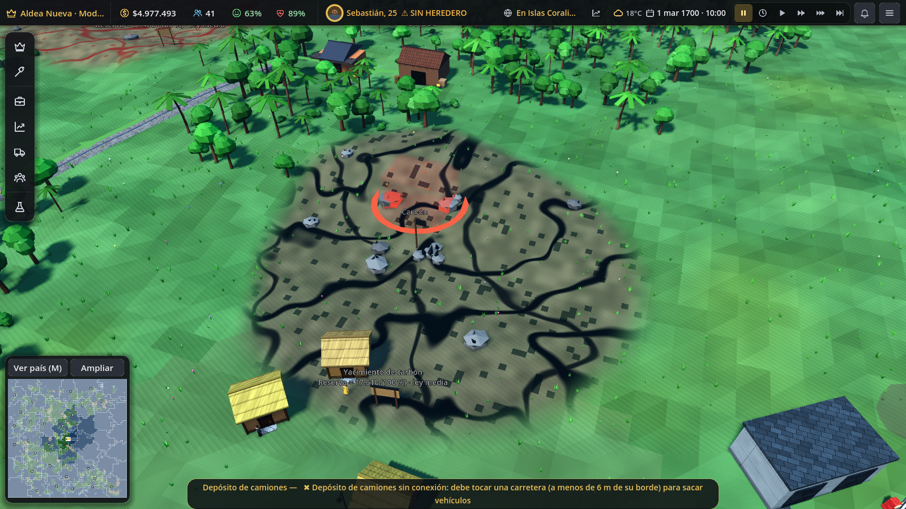
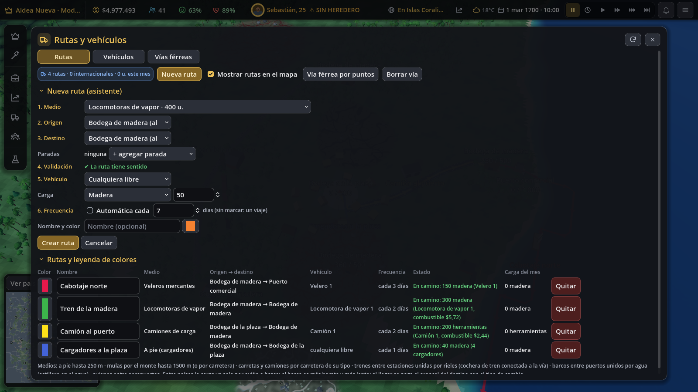
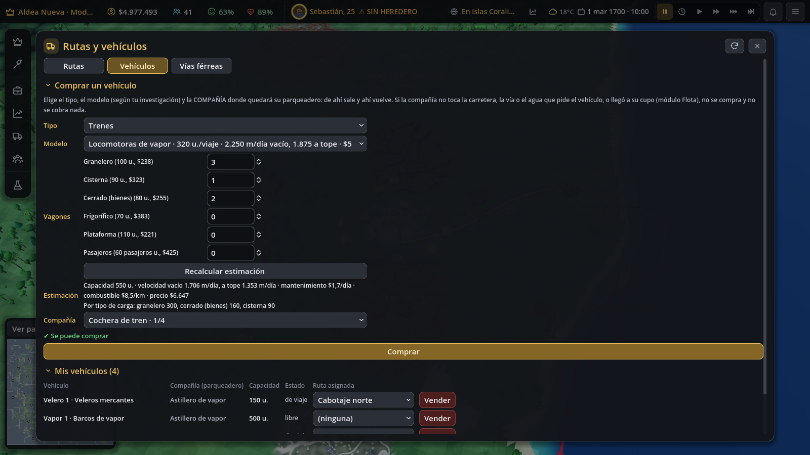

# Rutas punto X → punto Y, vehículos, barcos y trenes

Pedido de Sebastián: barcos que lleven carga dentro del país o a otros países, hasta almacenes junto al
punto de carga. Rutas definidas marcando un punto X y un punto Y, siempre que tengan sentido para el medio.
Cada ruta con su color. Vehículos que salen de su lugar y vuelven, con animación de salida y de entrada.

Cambio de diseño posterior (también de Sebastián): **el jugador no compra vehículos en garajes.** Hay un
panel central, **Vehículos**, donde se compra, se vende y se asigna. Cada vehículo queda en una
**compañía** del jugador, que es su parqueadero.

| | |
|---|---|
|  |  |
|  |  |
|  |  |

## Para el jugador

### Panel «Rutas y vehículos»
Se abre desde *Logística y transporte → Rutas* o *→ Vehículos*. Tiene tres pestañas.

**Rutas**
- Lista de todas las rutas. Cada una muestra:
  - color (editable, siempre único) y nombre (editable);
  - medio, origen → paradas → destino;
  - vehículo, frecuencia y estado;
  - carga del mes.
- «Mostrar rutas en el mapa» enciende o apaga la capa de rutas.
- **Nueva ruta** abre un asistente con seis pasos:
  1. medio;
  2. origen (y país);
  3. destino (y país), con paradas intermedias opcionales;
  4. validación, que dice por qué la ruta no tiene sentido;
  5. vehículo (uno concreto, cualquiera libre o, entre países, naviera);
  6. frecuencia: un viaje o automática cada X días.

  También se eligen la carga, el nombre y el color.

**Vehículos** (compra central)
- Para comprar, se elige:
  1. el tipo: animales, carretas, camiones, trenes, barcos o aviones;
  2. el modelo, según lo investigado (los que faltan muestran «requiere …»);
  3. la **compañía** donde quedará.
- Antes de comprar se ven la capacidad, la velocidad vacío y a tope, el mantenimiento, el combustible y el
  precio. En los trenes también se ve la capacidad por tipo de carga.
- Si la compañía no puede recibir el vehículo, se muestra el motivo y no se cobra.
- Lista «Mis vehículos», con:
  - compañía (parqueadero), capacidad y estado (libre, de viaje, sin conductor o sin conexión);
  - selector de **ruta asignada**;
  - en los trenes, «+ vagón…»;
  - botón **Vender** (40 % del precio).
- **A pie** no se compra nada: se abre la vacante de cargador en la Central de transporte.

**Vías férreas**
- Tramos de vía con su **ocupación**. Botones «Vía férrea por puntos», «Borrar vía» y «Hacer vía doble».

### Qué compañía puede recibir cada vehículo
| Vehículo | La compañía debe… |
|---|---|
| mulas, caballos | estar en tierra firme |
| carretas, camiones | tocar una carretera (a menos de 6 m de su borde) |
| trenes | tocar una vía férrea |
| barcos | ser un **puerto** o un **astillero** (necesitan agua) |
| aviones | ser un **aeropuerto** o un **hangar** (necesitan pista) |

- El vehículo **aparece en esa compañía**, sale de su puerta y vuelve a ella.
- Cada vehículo abre la vacante de su conductor, arriero, jinete o tripulación (`HiringSim.on_vehicle_bought`).
- Sin personal, el vehículo queda detenido.
- **Cupo por compañía**: lo pone el módulo «Flota» del negocio (ver *Contrato con ModulesSim*).

### Catálogo por investigación (todos menos a pie)
| Tipo | Modelos (tecnología) |
|---|---|
| Animales | mula (—), caballo de carga (Carretas de tiro) |
| Carretas | carreta (Carretas de tiro), carreta grande (Caminos empedrados) |
| Camiones | carro de vapor (Máquina de vapor), camión (Automóvil), camión pesado (Industria automotriz), tráiler (Automatización) |
| Trenes | locomotora de vapor (Ferrocarril), diésel (Industria automotriz), eléctrica (Electrónica) |
| Barcos | bote o balsa fluvial (—), velero mercante (Navegación), vapor (Máquina de vapor), carguero (Era moderna), portacontenedores (Electrónica) |
| Aviones | avión de hélice de carga (Aviación), jet de carga (Aeronáutica) |

- Cada modelo más nuevo carga más y es más rápido.
- La velocidad vacío es mayor que a tope. El bono va del 5 % en aviones al 20 % en animales.

### Trenes por composición
- Se compra la **locomotora** y luego los **vagones**, en la cantidad y del tipo que se quiera.
- La locomotora trae potencia, peso, velocidad máxima y número máximo de vagones.
- Tipos de vagón:

  | Vagón | Lleva |
  |---|---|
  | granelero | minerales, carbón, granos, lana, algodón, leña |
  | cisterna | petróleo, combustible, químicos, gas, agua |
  | cerrado | cualquier bien que no sea líquido ni refrigerado |
  | frigorífico | carne, comida, embutidos, conservas, pan, ganado |
  | plataforma | acero, maquinaria, motores, autos, madera, piedra, vidrio |
  | pasajeros | 60 pasajeros; no lleva carga |

- **Capacidad para un bien** = suma de los vagones que lo aceptan. Si el tren no tiene vagones para esa
  carga, la ruta lo dice.
- **Velocidad** = velocidad máxima × potencia / (peso × 6), acotada entre 0,3 y 1.
  - El peso = locomotora + tara de los vagones + carga (0,1 por unidad).
  - Más vagones cargados → tren más lento.
  - El panel muestra la velocidad vacío y a tope antes de comprar.
- **Bloqueo por tramos**:
  - Cada vía trazada es un tramo, y la vía a otro pueblo también.
  - Un tren ocupa los tramos de su camino desde que sale hasta que vuelve.
  - En un tramo cabe **un** tren, o **dos** si es **vía doble** (60 % del costo por metro).
  - Si un tramo está lleno, el despacho espera: «Esperando vía libre: tramo N ocupado por otro tren».
  - Un desvío también sirve: otra vía paralela es otro tramo.
  - La pestaña Vías muestra la ocupación.

### Rutas con sentido (validación por medio)
| Medio | Regla |
|---|---|
| A pie | distancia prudente, máx. **250 m** por tramo (`rutas.json walk_max`) |
| Mulas, caballos | por el monte hasta 1.500 m sin cruzar agua ancha; con carretera, sin límite |
| Carretas, camiones | carretera del tipo requerido que una ambos puntos (`RoadSim.connected` con `road_kinds`) |
| Tren | ambos puntos son una estación de tren o un almacén al lado de una, y las estaciones están unidas por rieles |
| Barco | ambos puntos son un puerto o un almacén al lado de un puerto, unidos por agua navegable |
| Avión | aeropuertos |

- Con paradas intermedias se valida cada tramo, por ejemplo «Tramo A → B: …».
- En el asistente se ve el motivo, y la ruta no se crea mientras no tenga sentido.

### Barcos y puertos
- **Puerto**: Muelle → Puerto comercial → **Puerto de contenedores** (Electrónica).
  - Solo se construye si **toca el agua** (costa, río o lago; si no: «Debe tocar el agua…»).
  - Es un almacén de 800, 3.000 o 10.000 espacios.
  - Los **almacenes construidos al lado** (a menos de 12 m entre bordes) quedan vinculados al puerto: al
    colocarlos, el ghost se pone verde con una flecha y «Almacén del puerto X».
- **Astillero** (Varadero → de vapor → industrial → de contenedores): debe tocar el agua. Es una base
  opcional de barcos.
- **Ruta nacional**: entre dos puntos de puerto unidos por agua. Se busca en una cuadrícula de agua y dos
  puertos de mar se unen siempre por el mar abierto. La distancia es la del camino por el agua.
- **Ruta internacional**: la regla de la Fase 10 cambia: **entre países la carga va por avión o barco**.
  - Por **barco propio**: un velero, vapor, carguero o portacontenedores desde un puerto de mar. Tarda
    km / (km/día del barco). Vuelve vacío y gasta poco combustible (el velero, ninguno).
  - Por **naviera**: flete por unidad, con salidas cada 7 días y capacidad limitada.
  - El barco es **más barato y más lento** que el avión. Colombia → Perú: 11 días en velero contra 1 en avión.
    Por unidad: naviera $0,48 contra vuelo comercial $1,77.
  - Al llegar se paga el **arancel del destino** con el **tipo de cambio**, igual que el avión
    (`AirSim._deliver`). El arancel va al tesoro del destino.

### Animaciones (solo en el país activo, pocos nodos)
- Los vehículos **salen de su compañía por la puerta**: el punto de la carretera, la vía o el agua más cercano.
- Recorren la ruta por el **camino real**:
  - carretera: Dijkstra sobre los tramos del tipo del vehículo;
  - vía: con locomotora y cada vagón siguiendo la vía detrás;
  - agua;
  - arco aéreo: despegue y aterrizaje.
- **Entran al destino** (se ocultan) y **descargan con una pausa** (12 % del tramo). Después **regresan** y
  vuelven a entrar a su compañía.
- Los cargadores a pie caminan con el bulto y se balancean al andar.
- Los barcos de viajes internacionales zarpan del muelle hacia el mar abierto y llegan desde él.
- Capa de rutas: una malla por ruta, del color de la ruta, sobre el camino real, con flechas de sentido cada
  14 m y el nombre en el medio. Los aviones van en arco.

### Colocar edificios: verde o rojo
Al colocar una base de flota (caballeriza, depósito de camiones, terminal de buses, cochera de tren, hangar
o astillero), el ghost se pinta:
- **verde**, con una flecha a su salida, si toca su red;
- **rojo**, con un anillo rojo y el motivo, si no la toca.

La terminal de buses sigue exigiendo tocar una carretera para comprar buses.

## Diseño técnico

### Archivos
| Archivo | Contenido |
|---|---|
| `data/rutas.json` | paleta, límites por medio, alcances, vías, agua, carga internacional por barco, bono de velocidad vacío, cupos por defecto, descuento de base de flota, **tipos de vagón**, masa por unidad |
| `data/resources.json` | medios con `tipo`: nuevos caballo, carreta grande, camión pesado, locomotoras (power, mass, max_wagons), eléctrica, barcos y jet de carga; tráiler pasa a Automatización |
| `data/businesses_naval.json` | Astillero (4 niveles) y Cochera de tren (2 niveles) |
| `data/businesses_comercio.json` | Puerto: `requires_shore`, `port`, `warehouse_capacity` y nivel 3 «Puerto de contenedores» |
| `scripts/sim/route_sim.gd` | `RouteSim`: adaptador común de rutas, colores y nombres, validación, distancias y caminos reales, creación, carga del mes |
| `scripts/sim/fleet_sim.gd` | `FleetSim`: compra central, compañía y red, cupos (ModulesSim), vagones, asignación, mantenimiento con base, reubicación y migración |
| `scripts/sim/vehicle_catalog.gd` | `VehicleCatalog`: catálogo por tipo y tecnología, stats, trenes por composición |
| `scripts/sim/ship_sim.gd` | `ShipSim`: agua, orilla, puertos y almacenes vinculados, conexión por agua, viajes internacionales |
| `scripts/sim/rail_sim.gd` | `RailSim`: vías internas por puntos, red, caminos, tramos, ocupación, vía doble |
| `scripts/sim/garage_sim.gd` | `GarageSim`: conexión de las bases de flota (ghost verde o rojo), salida |
| `scripts/ui/routes_window.gd` | `RoutesWindow`: pestañas Rutas, Vehículos y Vías |
| `scripts/ui/fleet_tab.gd` | pestaña «Vehículos» del edificio: cupos, vehículos de ese parqueadero, surtidor y botón al panel |
| `scripts/world/route_visuals.gd` | capa de rutas, vías internas, barcos internacionales, modelos de barcos, locomotoras y vagones |
| `tests/test_rutas_barcos.gd` | pruebas |
| `tests/screenshot_rutas.gd` | capturas en `docs/capturas/rutas/` |

### Contrato con ModulesSim (módulo «Flota», de otro agente)
- `FleetSim` busca la clase global `ModulesSim` **en tiempo de ejecución**, así que compila aunque no exista.
- Si existen, llama:
  - `ModulesSim.fleet_limit(gs, b, tipo) -> int`: cupo de vehículos de ese tipo en la compañía `b`;
  - `ModulesSim.fleet_types(gs, b) -> Array`: tipos admitidos.
- `tipo` ∈ `pie, animal, carreta, camion, tren, barco, avion` (`VehicleCatalog.TIPOS`).
- Si no existen:
  - el cupo es `rutas.json default_fleet.per_level[tipo] × nivel del negocio` (animal 3, carreta 2,
    camión 2, tren 1, barco 1, avión 1);
  - las bases de flota viejas usan su `garage` para su tipo;
  - se admiten todos los tipos menos `pie`.
- Flota nivel 1 = a pie: no se compra nada (`FleetSim.open_porter`).

### API para otros agentes
- `VehicleCatalog.models(gs, tipo, include_locked := false)` → modelos desbloqueados con stats:
  `{id, label, unit, tipo, capacity, speed_empty, speed_full, price, upkeep, fuel_per_km, crew, tech, unlocked, road_kinds}`.
- `VehicleCatalog.stats(gs, modelo, comp := {})` y `train_estimate(gs, modelo, comp)`.
- `FleetSim.buy(gs, compañía, modelo, comp := {})`, `buy_block_reason`, `sell`, `assign(gs, vid, route_id)`,
  `add_wagons` y `companies(gs, modelo)`.
- `LogisticsSim.buy_vehicle(gs, compañía, modo)` se conserva y delega en `FleetSim.buy`.

### Qué pasa con los edificios viejos y las partidas viejas
- **Bases de flota**: caballeriza, depósito de camiones, cochera, astillero y hangar ya no son obligatorios.
  - Siguen como base opcional: el vehículo que queda en la base de su tipo paga **25 % menos de mantenimiento**.
  - Su `garage` es su cupo.
  - El depósito conserva el surtidor de combustible.
- **Vehículos**: los que ya existían siguen en su base.
  - Si su base no existe, se reasignan a la compañía más cercana que pueda recibirlos, o se venden al 40 %
    (`FleetSim.migrate`).
  - Al demoler una compañía, sus vehículos pasan a la compañía más cercana compatible, o se venden.
- **Conexión provisional**: si la base de un vehículo no toca su red en una partida anterior, queda con
  `conn_legacy`. Sigue funcionando y se avisa al jugador.
- **Trenes de la primera versión**: `wagons: n` se convierte en `comp: {cerrado: n}`.
- **Rutas viejas** (logística, aviación, buses y caminos a pueblos): reciben color único y nombre al cargar
  (`RouteSim.ensure_colors`) y aparecen en el modelo común.

### Estado (se guarda solo, con valores por defecto)
- `logistics.rutas = {layer, trade: {pueblo: {color, name}}, version}`
- `logistics.rails = [{id, ctrl, pts, length, bridge, double}]`, `next_rail_id`, `rail_version`
- En cada ruta de carga: `color`, `name`, `stops`, `mq_cur`, `mq_last` y `mq_m` (carga del mes).
- En cada envío: `stops`, `garage` y `rail_sections`.
- En cada vehículo: `comp` (trenes).
- En las rutas aéreas o marítimas: `color` y `name`.
- En los viajes internacionales en barco (`countries.air.flights`): `ship` y `ship_mode`.
- En los edificios: `conn_legacy`.

No hace falta `SAVE_VERSION` nuevo: todo tiene valores por defecto.

### Economía cerrada
- Vehículos, vagones, vías, combustible y fletes se pagan afuera, como las demás obras e importaciones.
- El arancel va al tesoro del país destino.
- La prueba comprueba que `money_total + outflow` no cambia con un barco internacional (flete, combustible
  y arancel).

### Cambios en archivos compartidos
| Archivo | Cambio |
|---|---|
| `logistics_sim.gd` | `RouteSim.init_state`, validación geográfica antes de la flota, `stations`/`central_supports` incluyen las compañías con vehículos, `buy_vehicle` delega en `FleetSim`, capacidad y velocidad por vehículo y bien, tripulación por medio, bloqueo por tramos, paradas, color y nombre, carga del mes, mantenimiento con descuento, reubicación al demoler |
| `air_sim.gd` | `barco`/`naviera` delegan en `ShipSim.ship_intl`; mensajes «avión o barco»; decoración de rutas |
| `construction_sim.gd` | `ShipSim.placement_block_reason` (orilla) |
| `transit_sim.gd` | la terminal de buses debe tocar una carretera para comprar y operar buses |
| `hiring_sim.gd` | `vehicle_count` cuenta los vehículos de cualquier compañía |
| `hud.gd` | ganchos «Rutas» y «Vehículos» en `CATEGORIES`, `_item_active` y `_open_item` |
| `logistics_visuals.gd` | crea `RouteVisuals`; agentes por camino real con salida, pausa y regreso; trenes y barcos; ghost verde o rojo de las bases de flota y de los almacenes del puerto |
| `transit_visuals.gd` | trazado `rail` y `rail_erase` |
| `aviation_window.gd` | texto de la regla entre países |
| `test_almacenes.gd`, `test_fase10.gd`, `screenshot_fase10.gd` | adaptados: el depósito toca una carretera, el hangar está junto al aeropuerto y la mula se asigna a una compañía |

## Pruebas
```
godot --headless res://tests/test_rutas_barcos.tscn
xvfb-run -a -s "-screen 0 1600x900x24" godot --rendering-driver opengl3 --resolution 1600x900 res://tests/screenshot_rutas.tscn -- <ruta absoluta>/docs/capturas/rutas
```

`test_rutas_barcos` cubre:
- validación por medio: a pie lejos, camión sin carretera, tren sin rieles, barco sin agua, paradas;
- color único con más rutas que la paleta, y edición de color y nombre;
- compañía desconectada que no compra ni despacha y conectada que sí;
- compra central: catálogo según la tecnología, sin cobro ante un error, cupo, vacante, vender, descuento de base;
- trenes por composición: capacidad por carga, peso y velocidad, vagones, bloqueo por tramos y vía doble;
- barco nacional entre dos puertos, y barco internacional con arancel, tipo de cambio y ruta de naviera;
- migración: rutas viejas, conexión provisional, vehículo sin base, vagones viejos;
- dinero conservado;
- guardar y cargar;
- panel Rutas y asistente.
