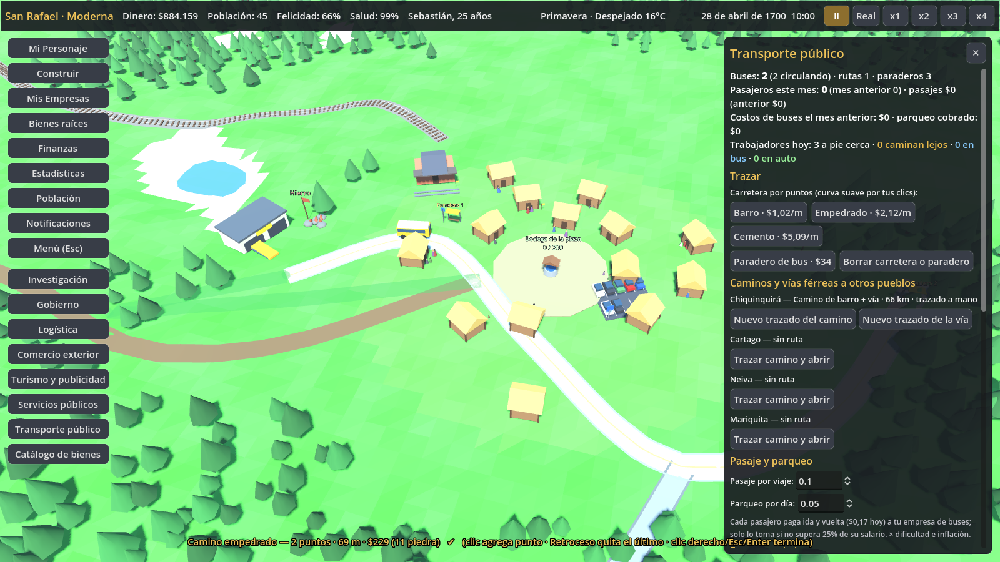

# Transporte: carreteras por puntos, rutas trazadas a mano, buses y parqueaderos

Pedido de Sebastián: las carreteras son opcionales y solo sirven si va a entrar carrocería al almacén,
si hay un parqueadero para los trabajadores o si van en bus. Hay que abrir la industria de buses con
investigación. Las carreteras, los caminos a otros pueblos y las vías de tren se trazan a mano para
que no se vean feas.



## Carreteras opcionales y con propósito
- **No hay caminos automáticos**: la gente camina por el terreno (casas, negocios y la plaza no
  necesitan carretera).
- Las carreteras son para vehículos:
  - **carretas, carros de vapor y camiones** que entran a un almacén o negocio: `LogisticsSim.route_block_reason`
    ya exigía que origen y destino estén a menos de 12 m de la misma red (camiones: empedrado o cemento);
  - **autos** de los trabajadores que van a un parqueadero;
  - **buses**, que solo circulan por carreteras empedradas o de cemento.
- Un almacén o negocio sin carretera **sigue funcionando** con cargadores a pie o mulas.
- El panel de cada edificio (salvo viviendas) muestra «Carretera: con acceso (tipo) · entran …» o
  «sin acceso — funciona igual; la carga va a pie o en mula».

## Trazado por puntos con curvas
- Botones en **Construir → Transporte**, **Logística → Carreteras** y el panel **Transporte público**:
  «Carretera por puntos» (barro, empedrado, cemento), «Paradero de bus» y «Borrar carretera o paradero».
- Clic, clic, clic: la vía sigue una **curva Catmull-Rom** que pasa por cada punto y se muestrea en
  tramos de ~4 m que se guardan en `RoadSim` (con `"poly"`: id del trazado). Así todo lo existente
  (redes, conexión, velocidad, mejoras) funciona igual.
- El primer y el último punto se pegan a la red existente (extremo o punto de un tramo a menos de 4 m).
- Vista previa con largo, costo total (y piedra) y el motivo del bloqueo: terreno del gobierno, fuera
  del mapa, dinero o agua.
- **Puentes**: se puede cruzar agua si ningún tramo mojado supera 36 m. Los metros sobre el agua cuestan
  ×5 y se dibujan como tablero elevado con pilares y barandas. Más ancho: «El agua es muy ancha».
- Clic derecho, Enter o Esc **termina** (construye); con menos de dos puntos, **cancela**. Retroceso
  quita el último punto.
- **Borrar**: clic sobre una carretera quita todo su trazado (o el tramo recto de partidas viejas), sin
  reembolso; clic sobre un paradero lo quita.
- Las carreteras por puntos se dibujan como franjas continuas con bordes y, en el cemento, línea central
  (`TransitVisuals`). Los tramos rectos antiguos siguen dibujándose como antes (`LogisticsVisuals`).

## Caminos y vías férreas a otros pueblos trazados a mano
- En **Comercio exterior** (cada pueblo) y en **Transporte público**: «Trazar camino y abrir», «Trazar
  camino» / «Nuevo trazado del camino», «Vía férrea por puntos» / «Nuevo trazado de la vía».
- El trazado va **desde la salida del pueblo** (a menos de 32 m de la plaza, a menos de 8 m de una
  carretera o, para el tren, a menos de 16 m de la estación de tren) **hasta el borde del mapa**
  (el último punto se pega al borde si está a menos de 12 m). Se permiten puentes de hasta 50 m.
  Si el jugador no traza nada se usa el **trazado automático** hacia el oeste, como antes.
- **Largo real**: factor = largo trazado / largo automático, acotado entre **0,9 y 1,25**.
  - Al **abrir** la ruta con trazado: el costo del camino (`connection_cost.road`) y los días de obra se
    multiplican por el factor (el acuerdo de paso no cambia).
  - Al abrirse la conexión, `distance` pasa a `base_distance × factor`: todo lo de `TradeSim` que usa
    la distancia (tiempo y costo de los viajes, mantenimiento, inmigración, reformas y vía) la usa.
  - **Vía férrea**: su costo y sus días se multiplican por el factor del trazado de la vía.
  - **Cambiar el trazado** de algo ya abierto o en obra cuesta el tramo local: m × $1,2/$2,5/$6
    (según el nivel del camino) o m × $5 (vía), × `price_mult`.
- Se guarda la polilínea en la conexión (`path`, `path_len`, `path_ctrl`, `rail_path`, `rail_len`,
  `rail_ctrl`, `base_distance`). Mientras el camino está en obra, queda en `transit.trade_paths` y se copia
  a la conexión al abrirse. **Partidas viejas**: sin `path` → trazado automático.
- `TradeVisuals` dibuja cada ruta trazada por su polilínea (las no trazadas comparten el camino
  automático). Las carretas de cada envío van por el camino de su pueblo.
- **Rieles** con su modelo: balasto, **durmientes** cada 0,9 m (MultiMesh) y **dos rieles** de acero. Una
  vía sin trazado propio va al lado del camino.
- La red eléctrica regional (`GridSim._touches_regional`) toca los caminos trazados a mano
  (`TransitSim.near_trade_path`).

## Industria de buses
- Tecnología **Transporte público** (`data/technologies_transporte.json`): época moderna, rama
  Transporte, 13.000 puntos, requiere *Automóvil*. El árbol la ubica solo, sin superponerse.
- Negocio **Empresa de buses** (`data/businesses_transporte.json`), centro de costo como la estación de tren:
  | Nivel | Tecnología | Buses | Empleos | Pasajeros por bus |
  |---|---|---|---|---|
  | Terminal de buses | Transporte público | 4 | 6 | 40 |
  | Depósito de buses | Industria automotriz | 10 | 14 | 40 |
  | Terminal central de transporte | Electrónica | 20 | 28 | 60 |
- Los buses se **compran en su edificio** (pestaña «Buses», $4.500 × `price_mult`), se venden al 40 % y
  se venden solos si se demuele la empresa. Cada bus necesita un **conductor** (empleado). Mantenimiento
  $1/día y combustible $3/km (mañana y tarde, ida y vuelta).
- **Paraderos**: se colocan con clic a menos de 6 m de una carretera empedrada o de cemento, separados al
  menos 12 m ($40).
- **Rutas**: automática (todos los paraderos unidos por carretera al depósito, del más cercano al más
  lejano; se actualiza sola) o **manual** (clic en los paraderos en orden en el panel). Cada tramo
  depósito → paradero → paradero debe estar unido por carretera de bus. Los buses se asignan a una ruta.
  Capacidad diaria = buses que operan × pasajeros por bus × vueltas en la hora punta (0,25 días).
- Los buses circulan en 3D por la red (camino más corto sobre las carreteras) de 5:30 a 21:00.

## Trayecto al trabajo (TransitSim.commute_daily, una vez al día)
Para cada empleado cuya casa está a más de **110 m** de su trabajo:
1. **Auto** (desde *Automóvil*, ahorros ≥ $300 × nivel de precios): si una carretera une casa y trabajo y
   hay un parqueadero tuyo con cupo a menos de 40 m del trabajo. Paga el parqueo ($0,05/día base) al
   parqueadero. Productividad ×1,04 y +2,5 de felicidad.
2. **Bus**: si hay un paradero a menos de 45 m de la casa y otro distinto a menos de 45 m del trabajo en
   la misma ruta en servicio, con cupo, y el pasaje de ida y vuelta no pasa del 25 % del salario. Paga
   el pasaje ($0,10 por viaje base, ajustable 0–1) a la empresa de buses. Productividad ×1,02 y +1,5 de
   felicidad.
3. **A pie lejos**: productividad hasta −10 % (lineal entre 110 m y 220 m) y hasta −3 de felicidad.

Así los negocios **pueden contratar gente de lejos** sin perder rendimiento. Quien vive a menos de 110 m
camina y no cambia nada (el pueblo inicial queda igual).

## Parqueaderos y penalización moderna
- **Parqueadero** (`data/buildings_transporte.json`, Construir → Transporte): desde *Automóvil*, 16 autos
  ($600); nivel 2 «de varios pisos» con *Industria automotriz*, 60 autos. Se dibujan los autos
  estacionados del día.
- **Penalización documentada**: desde *Automóvil* (época moderna), un negocio tuyo con empleos que no
  tiene **ni parqueadero a menos de 40 m ni paradero con bus en servicio a menos de 45 m** produce
  **×0,95** (`TransitSim.access_mult`, en `BusinessSim.expected_output`). El panel lo avisa en amarillo.

## Economía cerrada
- Pasajes y parqueo: el dinero pasa del vecino al negocio del jugador (`BusinessSim.earn`). La prueba
  verifica que tu dinero + el de los vecinos no cambia al cobrar.
- Carreteras, puentes, paraderos, buses, combustible, mantenimiento y trazados se pagan afuera, como las
  demás obras e importaciones.

## Guardado
`GameState.transit` (to_dict/load_dict, con valores por defecto; partidas sin `transit` arrancan vacías):
`polys`, `stops`, `routes`, `buses`, `trade_paths`, `commute`, `no_access`, `parking_use`, `fare`,
`parking_fee`, `next_id`, `month`, `last_month`, `totals`, `path_version`. Los tramos de las carreteras
por puntos están en `logistics.roads` con `poly` y `bridge`.

## Archivos
| Archivo | Contenido |
|---|---|
| `data/transit.json` | Parámetros (trazado, puentes, trayecto, bus, paraderos, pasaje, parqueo, acceso). |
| `data/technologies_transporte.json` | Transporte público. |
| `data/businesses_transporte.json` | Empresa de buses (3 niveles). |
| `data/buildings_transporte.json` | Parqueadero (2 niveles). |
| `scripts/sim/transit_sim.gd` | Curvas, carreteras por puntos, puentes, borrar, acceso, trazados a otros pueblos, paraderos, buses, rutas, trayecto, pasajes, parqueaderos, penalización y resumen. |
| `scripts/world/transit_visuals.gd` | Modo de trazado con vista previa, franjas de carretera, puentes, rieles, paraderos, buses y autos. |
| `scripts/world/trade_visuals.gd` | Reescrito: una línea por ruta trazada a mano, camino automático para las demás, rieles con durmientes. |
| `scripts/ui/transit_panel.gd` | Panel «Transporte público», sección de Construir y botones de trazado del comercio. |
| `scripts/ui/bus_tab.gd` | Pestaña «Buses» de la empresa de buses. |
| `tests/test_transporte.gd` | 90 comprobaciones. |
| `tests/screenshot_transporte.gd` | Genera `docs/capturas/transporte.png`. |

Cambios mínimos en archivos compartidos:
- `game_state.gd`: variable `transit` (to_dict/load_dict/_clear), `TransitSim.init_state`,
  `TransitSim.daily` después de `TradeSim.daily` y `TransitSim.monthly`.
- `business_sim.gd` (`expected_output`): productividad × `TransitSim.commute_mult` por empleado y
  × `TransitSim.access_mult` por negocio.
- `population_sim.gd` (`_happiness`): `+ TransitSim.happiness_delta`.
- `grid_sim.gd` (`_touches_regional`): usa `TransitSim.near_trade_path`.
- `world.gd`: agrega `TransitVisuals`. `logistics_visuals.gd`: no dibuja los tramos con `poly`.
- `hud.gd`: botón y panel «Transporte público». `building_panel.gd`: pestaña «Buses» y líneas de acceso.
- `build_menu.gd`, `logistics_panel.gd`, `trade_panel.gd`: botones de trazado.
- `tests/ui_smoke.gd`: traza una carretera, borra y abre el panel.

## Pruebas
```
godot --headless res://tests/test_transporte.tscn
xvfb-run -a -s "-screen 0 1600x900x24" godot --rendering-driver opengl3 --resolution 1600x900 res://tests/screenshot_transporte.tscn -- docs/capturas
```
