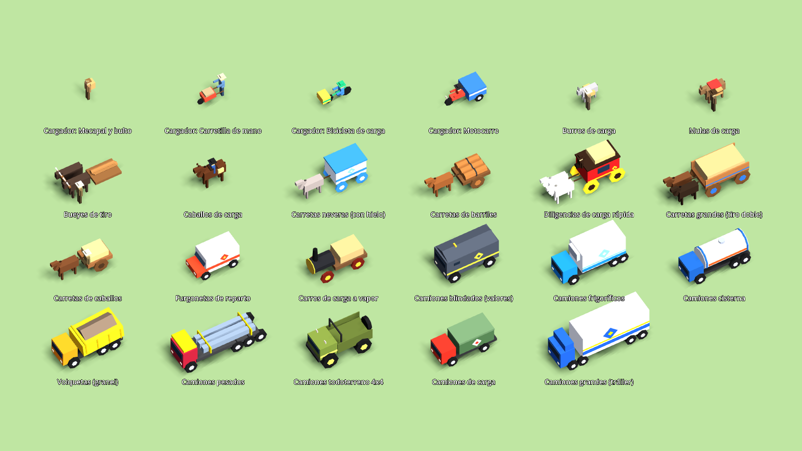
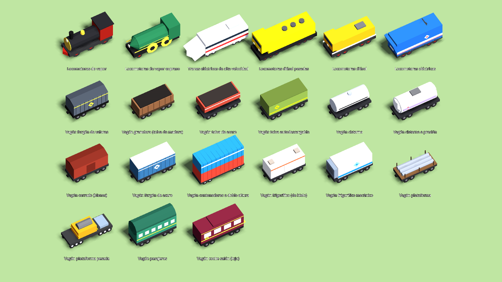
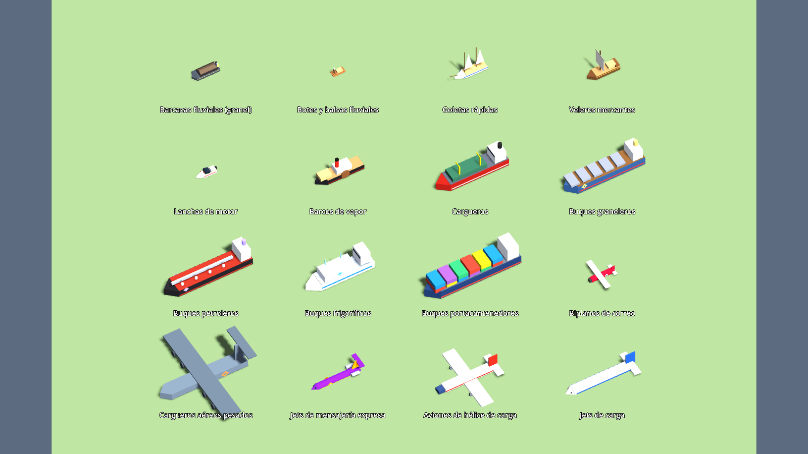
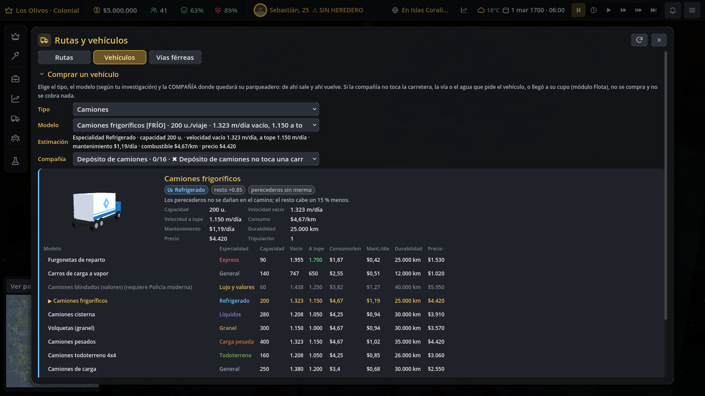
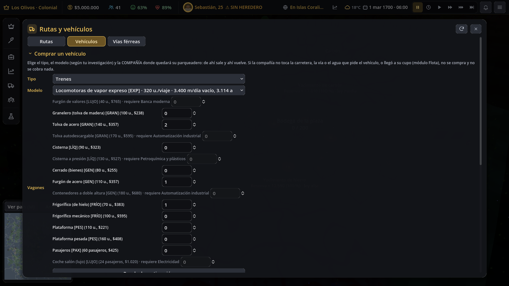

# Variedad de vehículos y vagones

Pedido del usuario (pendientes, sección L):
- varios modelos por tipo y época, desbloqueados por investigación;
- propiedades distintas para cada modelo y tradeoffs reales;
- especialidades con efecto en la simulación;
- un diseño 3D low-poly único y una librea propia para cada modelo y vagón;
- una ficha comparativa en el panel de compra;
- las partidas viejas siguen cargando.

| | |
|---|---|
|  |  |
|  |  |



## Catálogo

Cada modelo tiene:
- **especialidad** (`spec`);
- capacidad, velocidad vacío y a tope, consumo por km, mantenimiento por día;
- **durabilidad** (km de servicio), precio y tecnología;
- en los modelos de carretera y animales, el **nivel del Parqueadero y flota** (`parking_level`).

Los datos están en `data/resources.json → transport.modes`; los vagones, en `data/rutas.json → wagon_types`.

| Tipo | Modelos (especialidad · tecnología) |
|---|---|
| A pie (equipo de los cargadores) | mecapal (general) · carretilla de mano (pesada, Carretas de tiro) · bicicleta de carga (express, Producción en serie) · motocarro (general, Automóvil) |
| Animales | burro (general, barato) · mula (todoterreno) · caballo (express, Carretas) · bueyes (pesada, Arado de hierro) |
| Carretas | carreta · carreta de barriles (líquidos) · carreta grande (pesada, Caminos empedrados) · diligencia (express, Caminos empedrados) · carreta nevera (refrigerado, Conservas) |
| Camiones | carro de vapor (Máquina de vapor) · furgoneta (express, Automóvil) · camión (Automóvil) · 4x4 (todoterreno) · volqueta (granel) · cisterna (líquidos) · camión pesado (pesada; los cuatro, Industria automotriz) · frigorífico (refrigerado, Refrigeración) · blindado (lujo y valores, Policía moderna) · tráiler (Automatización) |
| Locomotoras | vapor (Ferrocarril) · vapor expreso (express, Acero estructural) · diésel (Industria automotriz) · diésel pesada (pesada, Minería moderna) · eléctrica (Electrónica) · alta velocidad (express, Automatización) |
| Barcos | bote o balsa · barcaza (granel, Navegación) · goleta (express, Navegación, internacional) · velero · vapor · lancha de motor (express, Automóvil) · carguero · granelero (granel, Era moderna) · petrolero (líquidos, Petroquímica) · buque frigorífico (refrigerado, Refrigeración) · portacontenedores |
| Aviones | biplano de correo (express, Aviación) · avión de hélice · jet de carga · jet expreso (express, Automatización) · carguero aéreo pesado (pesada, Electrónica) |

**Vagones por modelo.** Cada vagón hereda de su clase lo que no define, por ejemplo la carga que acepta.

| Clase | Modelos |
|---|---|
| granelero | tolva de madera · tolva de acero (Acero estructural) · tolva autodescargable (Automatización) |
| cisterna | cisterna · cisterna a presión (Petroquímica) |
| cerrado | cerrado · furgón de acero (Acero estructural) · contenedores a doble altura (Automatización) |
| frigorífico | de hielo · mecánico (Refrigeración) |
| plataforma | plataforma · plataforma pesada (Acero estructural) |
| pasajeros | coche de pasajeros · coche salón de lujo (Electricidad) |
| valores | furgón de valores (Banca moderna): solo bienes valiosos |

**Tradeoffs.** En cada tipo, el modelo más rápido no es el que más carga. La prueba lo comprueba. Algunos ejemplos:
- La furgoneta va a 1.700 m/día con 90 u.; la volqueta, a 1.000 m/día con 300 u. (375 si lleva granel).
- El burro cuesta $35 y lleva 18 u.; los bueyes llevan 55 u. pero van a 170 m/día.
- La goleta es más rápida que el velero (260 contra 170 km/día) y carga la mitad.
- El expreso de vapor va a 3.400 m/día, pero solo admite 5 vagones.

**Niveles del Parqueadero y flota** (módulo de ModulesSim, docs/MODULOS.md):

| Nivel | Modelos |
|---|---|
| 2 | animales |
| 3 | carretas |
| 4 | carro de vapor |
| 5 | camiones, incluidos furgoneta, 4x4, volqueta, cisterna, frigorífico y blindado |
| 6 | camión pesado y tráiler |

- `FleetSim.parking_reason` lee `ModulesSim.applies/level`. Solo lo hace en las compañías donde ese módulo aplica; las estaciones de transporte siguen con su regla.
- El cupo sigue saliendo del contrato `fleet_limit` / `fleet_types`.

## Especialidades y su efecto en la simulación

Todo es determinista: no interviene el azar. Se configura en `rutas.json → specialties`, `cargo_classes` y `cargo_loss`.

| Especialidad | Efecto |
|---|---|
| general | sin bonos (los modelos de antes son generales o conservan su capacidad: la economía de siempre no cambia) |
| refrigerado | los **perecederos** (carne, comida, embutidos, pan, ganado, conservas) no sufren merma; el resto de la carga cabe ×0,85 |
| granel | minerales, granos, lana y leña ×1,25; la carga suelta ×0,6 |
| líquidos | petróleo, combustible, químicos, gas y agua ×1,3; **no lleva otra cosa**: la ruta se rechaza («no llevan madera») y el barco no se elige para ese envío |
| pesada | acero, maquinaria, motores, madera, piedra y vidrio ×1,3; en una locomotora, el peso no la baja de la mitad de su velocidad (en vez del 30 %) |
| lujo y valores | joyas, oro, plata, relojes, electrónica, medicamentos, ropa fina y loza sin merma; el resto ×0,7 |
| todoterreno | en caminos malos va como en empedrado (multiplicador de carretera mínimo 1,35); el 4x4 entra a caminos de barro, a diferencia del camión; la mula llega 1,6 veces más lejos por el monte |
| express | +1 viaje por día (el tope pasa de 4 a 5) y la merma de perecederos baja a la mitad |
| pasajeros | no lleva carga (vagones de pasajeros) |

**Merma en el camino** (`LogisticsSim._complete_shipments`):
- Se aplica a los perecederos que van sin frío y a los valiosos que van sin vehículo de valores.
- Perecederos: 6 % por día de viaje de ida pasado 1,5 días de gracia, con tope del 35 %.
- Valiosos: 2 % por día pasado 1 día, con tope del 12 %.
- La merma se calcula al despachar (`shipment.loss`) y se descuenta al entregar.
- Se suma en `logistics.stats.month_lost / total_lost`.
- En los trenes cuenta la parte de la capacidad que va en vagones que no protegen esa carga. Los perecederos solo caben en frigoríficos, así que nunca se dañan en tren.
- Los viajes cortos dentro del pueblo no tienen merma.

**Desgaste** (`rutas.json → wear`):
- Cada vehículo suma km en cada viaje.
- Cuando supera su durabilidad desde la última revisión:
  - el mantenimiento sube un 25 %, más un 50 % por cada vida extra, con tope ×2;
  - la velocidad baja un 10 %.
- La **revisión** (botón «Revisión N %» en *Mis vehículos*, `FleetSim.overhaul`):
  - cuesta el 35 % del precio;
  - se paga con «mantenimiento» de su compañía;
  - deja el desgaste en 0.

**A pie**:
- El equipo de los cargadores es global (`logistics.porter_gear`).
- Se compra con `FleetSim.buy_gear`. Cuesta su precio × el número de cargadores (mínimo 4) y lo paga la primera central.
- Cambia la capacidad, la velocidad, el consumo y el mantenimiento de todos los cargadores.
- No cambia el contrato con ModulesSim: «pie» sigue siendo solo vacantes.

## Diseño 3D (`scripts/world/vehicle_models.gd`)

**Recetas.**
- Hay una receta `_r_<id>` por modelo, vagón y equipo de cargador: 60 en total.
- Cada receta tiene su propia silueta, no un recolor. Algunos ejemplos:
  - la cisterna lleva un tanque cilíndrico y domo;
  - la volqueta, una caja inclinada con el montón de carga;
  - el 4x4, un arco antivuelco y la llanta de repuesto;
  - el tren de alta velocidad, una nariz en cuña;
  - la tolva, una sección en V;
  - el contenedor, doble altura;
  - el petrolero, una tubería central;
  - el biplano, dos alas.
- Cada receta tiene también su propia librea: colores, franjas laterales, un logo en rombo con un punto central, y faros y ventanillas emisivas de noche.

**Rendimiento.**
- Todas las piezas de un modelo se unen en **una malla** con color por vértice. La malla usa el material compartido de MeshLib (`building_mat`), que no se tocó.
- Resultado: una llamada de dibujo por vehículo y un solo material para toda la flota.
- La malla se genera una vez por modelo y se cachea. Todos los vehículos del mismo modelo comparten malla.
- El modelo más pesado tiene menos de 2.500 triángulos.
- **LOD**: a más de 150 m, la malla detallada pasa a un proxy de 1 a 3 cajas sin sombra (`visibility_range`).
- Los envíos siguen limitados a pocos agentes por envío, como antes (`MAX_AGENTS_PER_SHIPMENT`). Por eso no hizo falta MultiMesh: el costo por agente bajó de unos 15 nodos a 2.

**Uso.**
- `LogisticsVisuals._carrier_model` y `RouteVisuals.ship_model/locomotive_model/wagon_model` delegan en `VehicleModels.node(id)`.
- A pie se usa `VehicleModels.porter_node(equipo)`.
- `VehicleThumb` (`scripts/ui/vehicle_thumb.gd`) es la miniatura 3D giratoria: un SubViewport con mundo propio.

## Panel de compra (pestaña Vehículos)

La ficha del modelo elegido muestra:
- la miniatura 3D;
- la especialidad, con chips de sus efectos;
- capacidad, velocidad vacío y a tope, consumo, mantenimiento, durabilidad, precio y tripulación;
- una **tabla comparativa** con todos los modelos del tipo:
  - lo mejor de cada columna va en verde;
  - los modelos bloqueados muestran «requiere …»;
  - se hace clic en un modelo para elegirlo.

Además:
- Vagones: la lista por modelo muestra la especialidad y los que faltan por investigar, con el selector bloqueado.
- A pie: tarjeta «Equipo de los cargadores».
- *Mis vehículos*: botón de revisión con el desgaste.

## Guardado y partidas viejas

- **Los ids de los modelos de antes no cambian**, así que sus vehículos cargan igual.
- `VehicleCatalog.migrate_vehicle` corre en cada carga, desde `RouteSim.init_state`:
  - un modo que ya no existe se mapea con `rutas.json → legacy_modes`; por ejemplo, `barco` → `vapor_barco` y `tren` → `tren_vapor`;
  - rellena `km`, `trips` y `serviced_km` con 0;
  - los vagones de tipo desconocido pasan a «cerrado».
- `porter_gear` faltante equivale a «mecapal».
- No hace falta `SAVE_VERSION` nuevo.

## API

- `VehicleCatalog`:
  - `spec_of`, `spec_label`, `cargo_mult`, `can_carry`;
  - `loss_frac(mode, good, días, v)`, `extra_trips`, `road_min_mult`, `offroad_range_mult`;
  - `wear_of`, `wear_upkeep_mult`, `wear_speed_mult`, `overhaul_price`;
  - `gear_*`, `eff_def(gs, mode)`;
  - `wagon_def`, `wagon_ids`, `wagon_unlocked`;
  - `sheet(gs, mode, comp)`, la ficha con sus efectos;
  - `migrate_vehicle`.
- `FleetSim`: `parking_reason`, `overhaul`, `overhaul_block_reason`, `buy_gear`, `gear_block_reason`.
- `VehicleModels`: `node`, `porter_node`, `meshes`, `has_model`, `ids` y `triangles`.

## Archivos compartidos que se tocaron

| Archivo | Cambio |
|---|---|
| `logistics_sim.gd` | `trip_info` usa el equipo de los cargadores, la especialidad, el todoterreno, el express, el desgaste y la merma; `create_route` rechaza un bien que el modelo no lleva; merma al entregar; mantenimiento por vehículo con desgaste y del equipo de los cargadores; avión doméstico por familia |
| `route_sim.gd` | `family` reconoce los aviones por tipo (el jet de carga caía en «animal») y a pie por tipo; alcance todoterreno; migración en `init_state` |
| `fleet_sim.gd` | nivel de parqueadero; vagones sin investigar; revisión; equipo de los cargadores; migración |
| `air_sim.gd` | cualquier modelo de avión propio vuela al exterior, con su capacidad y su consumo relativo |
| `ship_sim.gd` | capacidad del barco según la carga; no se elige un barco que no la lleva |
| `logistics_visuals.gd`, `route_visuals.gd` | modelos de `VehicleModels` (las variables que lee el audio no cambian) |
| `audio_manager.gd` | los modelos nuevos suenan según su tipo; ningún avión suena en tierra |
| `routes_window.gd` | ficha comparativa, vagones por modelo, equipo de los cargadores y revisión |

No se tocaron el shader del terreno, el pulido gráfico ni `ModulesSim`.

## Pruebas
```
godot --headless res://tests/test_vehiculos_variedad.tscn
xvfb-run -a -s "-screen 0 1600x900x24" godot --rendering-driver opengl3 --resolution 1600x900 res://tests/screenshot_vehiculos.tscn -- <ruta absoluta>/docs/capturas/vehiculos
```
